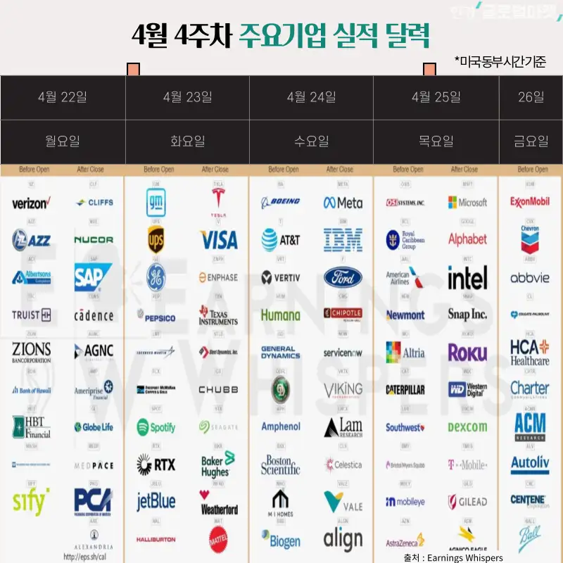
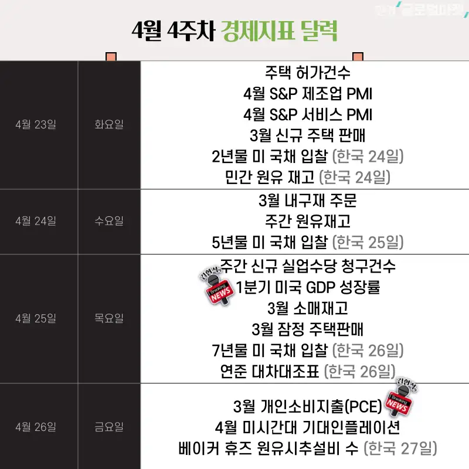

## 2024/04

## 2024.04.26 (미국시간 : 2024.04.25)

## 2024.04.25 (미국시간 : 2024.04.24)
- [김현석의 월스트리트나우 - AI 투자, 지나쳤다?…메타, 역대급 실적에도 시간 외 17% 폭락](https://www.youtube.com/watch?v=nEA8ssLRlkM)

 

메타 실적 발표 후 급락. 메타는 실적이 좋았고 ROE 도 18% 정도로 좋은데도 폭락했다. 이유는 이날 방송이 아닌 다른 방송을 듣다가 알게됐다.(귀로만 들었다.) Capex 가 8Billion USD 정도만 투입된 것을 보고 매도를 한것으로 보인다고 한다. SMCI 실적 관련 이슈도 이것과 관련 있어 보인다는 이야기를 들었다. 

이날 아침 AFT 장. 데이마켓에서 메타 실적관련 내용들 때문에 AI 관련 Capex 투자에 부정적인 전망 때문에 NVDA, SMCI 가 꽤 많이 하락했다. 오후에 Pre Market 에서는 다시 복구해서 올라왔다. 

몇 주 동안 지켜본 걸로는 NVDA, SMCI 는 데이마켓, PRE장에서 하락하고 본장 열릴때 미친듯이 올라갔다가 종가는 하락하는 경우가 많다. 투기 세력도 조금 섞여있어서 그런듯 싶다. SMCI 실적 발표가 4월 30일이라 그때까지는 이런 변동성이 계속 있을 듯 하다. 
 

## 2024.04.24 (미국시간 : 2024.04.23)
- [김현석의 월스트리트나우 - 경제 위축인가? 지수 급반등…테슬라 실적 엉망인데 시간외 폭등 이유는?](https://www.youtube.com/watch?v=5d95e3t2EyQ)

테슬라 이야기는 가급적이면 직장 점심시간에도 왠만하면 하지 말아야 할듯하다. 테슬라에 진심인 분들이 너무 많다.  
하루 다음날인 2024.04.25 에 이 기사를 스크랩하고 있는데, 이날 이 뉴스 하면서 기자님 댓글테러 당했나보다. 

난 실적 시즌에 주가가 어떤 식으로 움직이는지 월가는 어떤식으로 판단하는지 이런 것들을 나중에 다시 보기 위해 잠시 링크를 남겨뒀다. 

이번주는 주중에 너무 바쁘다. 주식 공부할 시간이 없다. 
주말에 보고 공부하게 되겠네 싶었다. 
 

## 2024.04.22 \~ 2024.04.26 실적 캘린더

 

## 2024.04.22 \~ 2024.04.26 경제지표 캘린더

 

## 2024.04/19

뉴스 정리 예정. SMCI 실적 예상치 관련 하락. 이날 하락 정말 컸다. 

이스라엘, 이란 분쟁 이슈가 크다. 

- 중동분들은 종교도 진짜 피흘리면서 지키는 종교이고 정치도 피를 흘리는 정치여서 참 무서운 지역이라는 생각이...

 

## 2024/04/10

> 기사 본문 : [10시 반 쏟아진 매물 ... 보스틱 "CPI, 예상대로면 발전"](https://www.hankyung.com/article/202404090859i) 

이날 있었던 하락부터 심상치 않았던 것 같다. 이전에도 조금씩 기술주가 휘청거려도 다시 자리 잡고 그랬는데, 4월 10일 들어서부터 이상하게 수급이 맥아리가 없는건가 싶기도 하고 시들시들한 느낌이 들었다. 

이날 뉴스 중 아래 그래프가 재미있었다.

 

미국의 세금 납부일은 4월 15일 이라고 함. 계절적으로 4월마다 수익이 난 주식을 한꺼번에 파는 방식의 매도가 많이 평균적으로 많이 나타난다고함.  

 

## 개인적인 4월 계획
한국장은 당분간은 계속 조선주, 조선 기자재, 미용의료(비올) 만 매수했다가 50프로 비중축소, 매수했다가 50프로 비중축소만 이렇게 하는 걸 반복해야겠다 싶음. 한국 특유의 팔딱팔딱 뛰는 그런 바운스가 나한테는 너무 현기증 나고 힘들다.  

중동 이슈도 있기 때문에, 해운이 늦어지면, 배를 더 주문하려고 할거고, 조선 쪽이 수요에 비해 공급이 부족해지는게 앞으로도 더 심해질까 하는 생각을 해서 조선주에 관심을 가지던 찰나에 삼성중공업이 흑자전환을 했네... 한화오션은 방산까지 잘하네...  갑자기 FSRU 에도 관심이 생겼네... 뜬금없이 씨에스윈드도 관심이 가네...  

이런 상황인데 주가는 또 한국 특유의 미친놈들 투기장세여서 참... 그래도 1년 동안 어떻게든 모아가봐야 하는데, 타이밍 잘 잡아서 모아가야 하지 않나 싶음 

출산율 정책 뜨면 실적 이런거 확인 안하고 아가방 풀매수 들어가고, 가끔 가다 몇번씩은 흥아해운 흥구석유 이런 종목 몰빵하고 자율주행에 가온칩스,오비고 인공지능에 한글과컴퓨터 이런거 몰빵하는 형님들이 있는 시장인데 뭐..ㅎㅎ 정떨어질만 하지ㅋㅋ 

미국장은 계속 모아가던거 그대로 모아가고, 이번 하락장에 소형성장주 ETF(무슨종목인지는 안적을거임!!), 반도체 ETF에 관심이 생겼다. 이익이 지금보다 더 날지 이런것들 고민해보고 매수해볼까 생각중. 올해는 왠지 펀드매니저들이 손 못대는 종목에서 크게 수익이 날까? 하고 생각을 가끔 해봤다(생각만...ㅋㅋ) 
 

미국장은 전적으로 유동원 아저씨 유튜브 채널, 김현석 기자님 기사보면서 공부중. 
 

