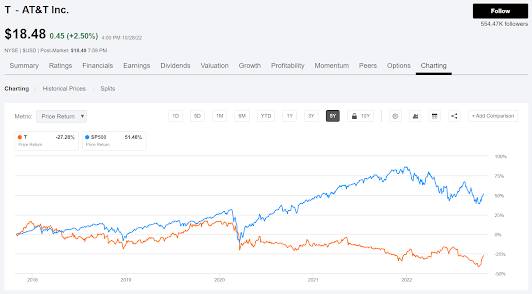
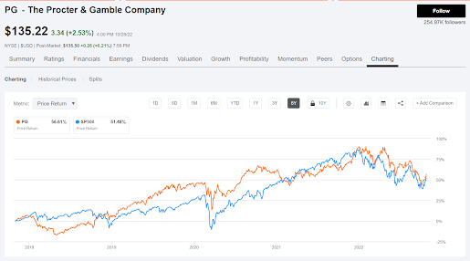
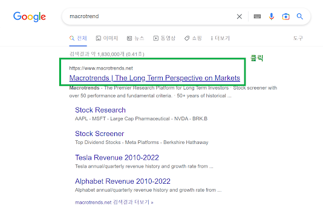
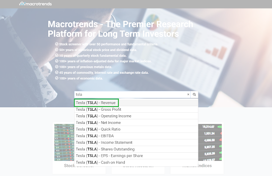
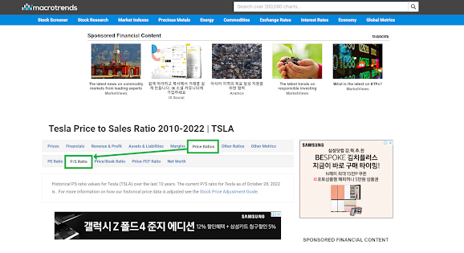

> 글의 작성 시점이 정확히는 기억이 안나지만 2021년도 이전이기에 현재(2024.02) 시점에서는 다소 안맞는 부분들이 있습니다. 
 

#### 주식의 유형 (저성장주, 대형우량주, 고성장주, 경기순환주, 회생주, 자산주)
- 저성장주
- 대형우량주
- 고성장주
- 경기순환주
- 회생주
- 자산주
 

#### 저성장주
성숙한 대기업 주식. 
대체적으로 GNP보다 약간 빠른 정도의 속도로 성장하는 기업 
처음부터 저성장주였던 것은 아니고, 설립 초기에는 고성장주였지만 회사가 성장할 만큼 모두 성장했거나 해당 산업이 과거와는 다르게 침체기에 빠져서 이 산업군에 속한 기업이 성장의 탄력을 잃는 경우가 저성장주에 해당한다. 
 

##### 저성장주 특징
주식이 등락폭이 적다. 주가가 완만하게 움직인다. 배당금이 넉넉하다. 
 

##### e.g. AT&T 
검색 조건을 5Y 로 검색 (seeking alpha) 

 

#### 대형우량주
주가가 빠르게 오르는 기업은 아니지만, 저성장주보다는 조금 빠르게 성장하는 기업 
이름이 많이 알려진 대기업들이 대형우량주에 속한다. 
e.g. 코카콜라, P&G 
 

##### e.g. P&G
검색 조건을 5Y 로 검색 
S&P보다 약소하게 높다. 

 

#### 고성장주
피터린치는 기업을 현명하게 잘 선택했을 경우 10루타에서 40루타까지 이익을 볼수 있다고 했다고 한다. (10루타의 의미는 10배의 수익을 의미) >
고성장주는 상대적으로 위험이 높다. 
그만큼 기업의 성장에 투자되는 자금이 크다. 
신생기업의 경우 성장성이 높아도 자금이 부족해 파산하는 경우가 많다. 
따라서 고성장주에 투자시 주의해서 투자해야 하고, 성장이 언제쯤 둔화될지도 세심하게 파악해야 한다. 
매출 성장성이 높아도 순이익은 상대적으로 낮을 수 있다. 
 

기업이 한참 성장하는 시기는 이익보다는 매출성장성이 커지는 패턴을 보이기 때문. 
 

##### e.g. TSLA
구글 검색창에 macrotrend 검색 > macrotrends.net 링크 클릭 

 

TSLA 검색 > Revenue 클릭 

 

이후 나타나는 화면에서 Price Ratios 클릭 > P/S Ratio 버튼 클릭 
 

참고) 
PS Ratio = 시가총액 / 1년에 번 매출 
시가총액 = 주가 x 총 발행 주식 수 

 

#### 경기순환주
매출이 어느 정도 예측 가능한 방식으로 오르고 내린다. 경기가 좋을 때는 경기순환주의 실적과 주가가 같이 오르고 경기 침체기 때는 이런 종목들의 실적도 안좋고 주가도 하락 
대기업 또는 이름이 많이 알려진 기업들이 많아서 대형 우량주와 혼동하기 쉽다. 
소비, 경기에 민감한 항공, 자동차, 호텔 같은 산업군이 경기 순환주에 속한다. 
경기가 좋을 때는 소비가 많기에 호황(자동차, 호텔, 항공, 여행 급증), 
경기 침체기를 벗어나는 시점에 주가 상승 폭이 대형 우량주보다 훨씬 빠르게 상승. 
##### e.g. BA (보잉), DAL(델타항공)
 

#### 회생주
파산 가능성이 높은 기업 
파산 위기에서 벗어난 기업은 바닥을 찍은 주가가 빠르게 회복을 한다. 
회생주의 주가가 상승을 시하면 시장 상황에 크게 좌우되지 않는다. 
아무리 세계적인 기업이어도 파산할 가능성이 있기 때문에 회 뒤에 투자시 회사의 부채비율은 어떤지 추가 자금 동원능력은 있는지 
현금 보유액은 어느 정도 되는지 재무제표를 보고 투자를 결정해야 한다. 
 

#### 자산주
기업이 가진 자산이 가치가 있는 자산일 경우 그 자산의 가치가 주가에 반영되지 않은 기업 
눈에 보이는 자산일 수도 있고 눈에 보이지 않는 무형 자산일 수도 있다. 
재무제표에서는 보이지 않는 자산일수도 있다. 
 

##### e.g. 맥도날드
전국에 보유하고 있는 수천개의 매장. 부동산 가치 상승으로 인해 엄청난 자산주로 분류 
 

##### e.g. 디즈니
여러 유형을 거친 종목 
한때는 성장성이 큰 고성장주로 분류 
규모가 커지고 자금력이 강해진 이후로는 대형우량주로 안착 
그 이후에는 부동산, 영화, 만화 등 엄청난 지적재산권과 같은 자산을 보유한 자산주로 분류 
 
