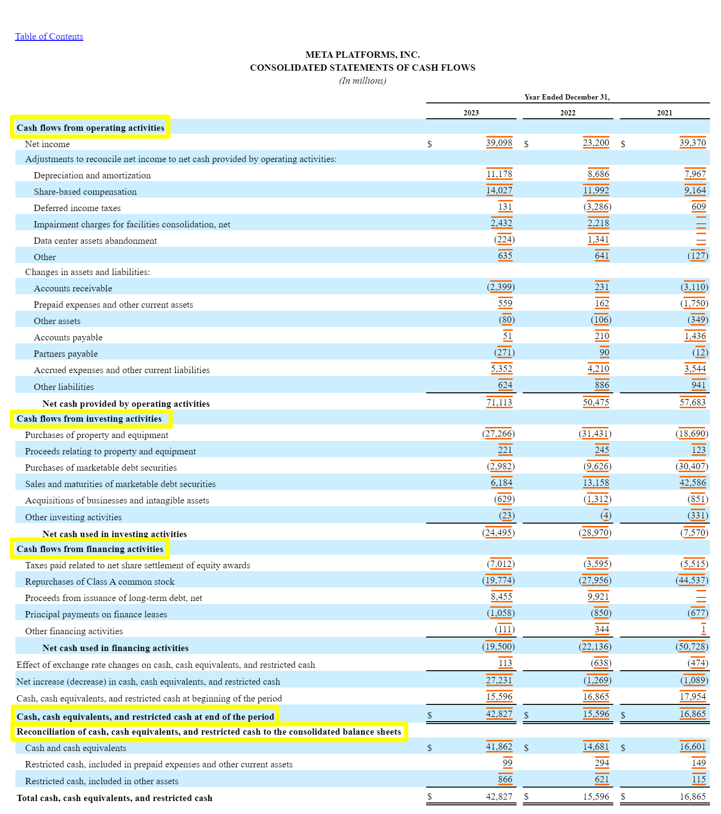
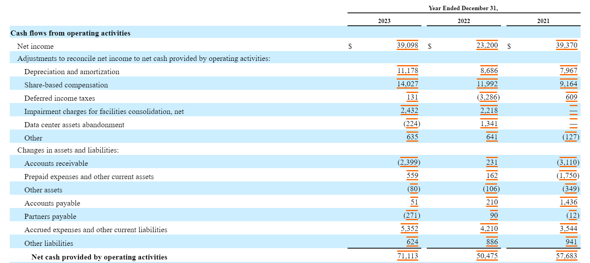
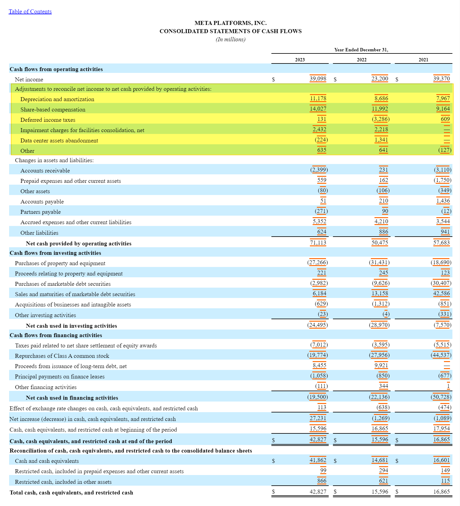
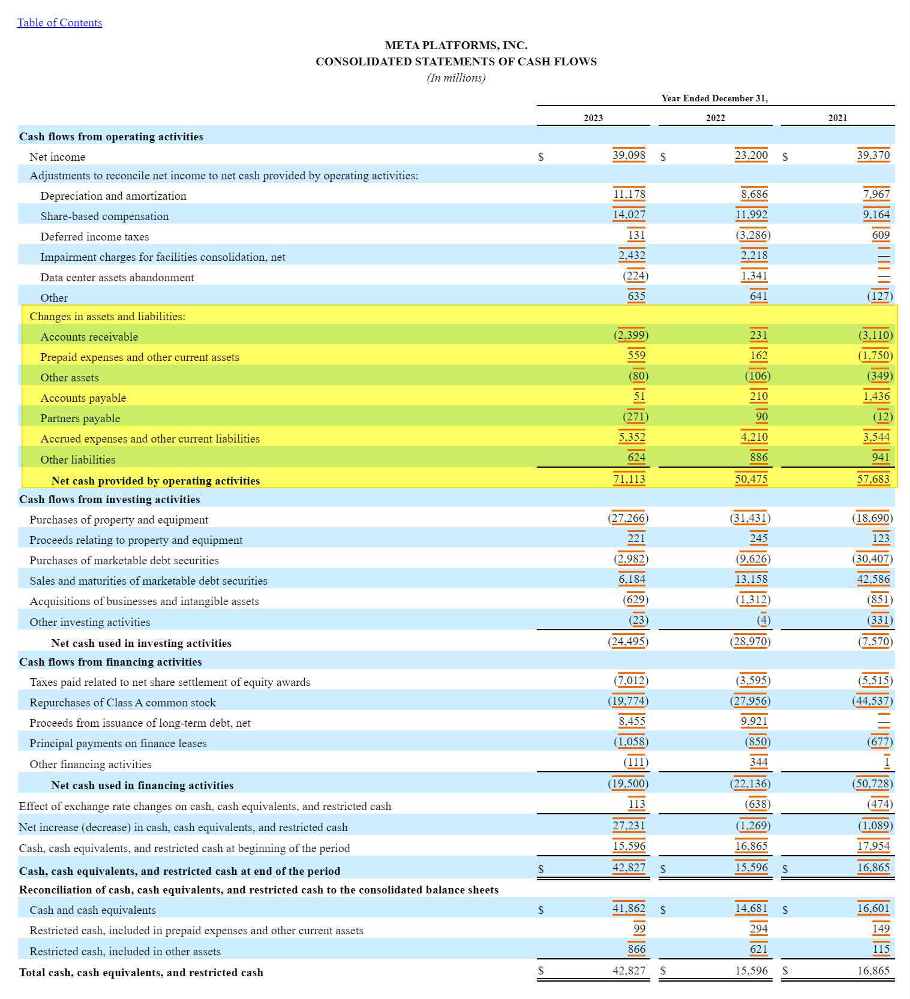
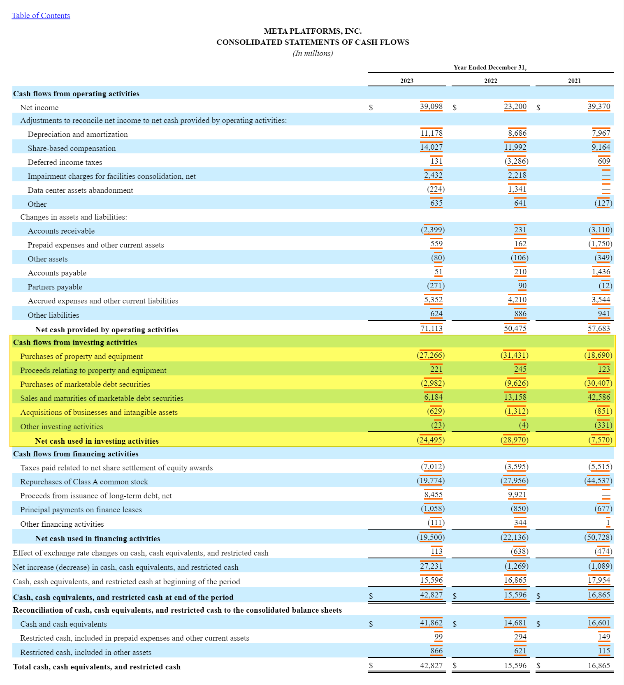
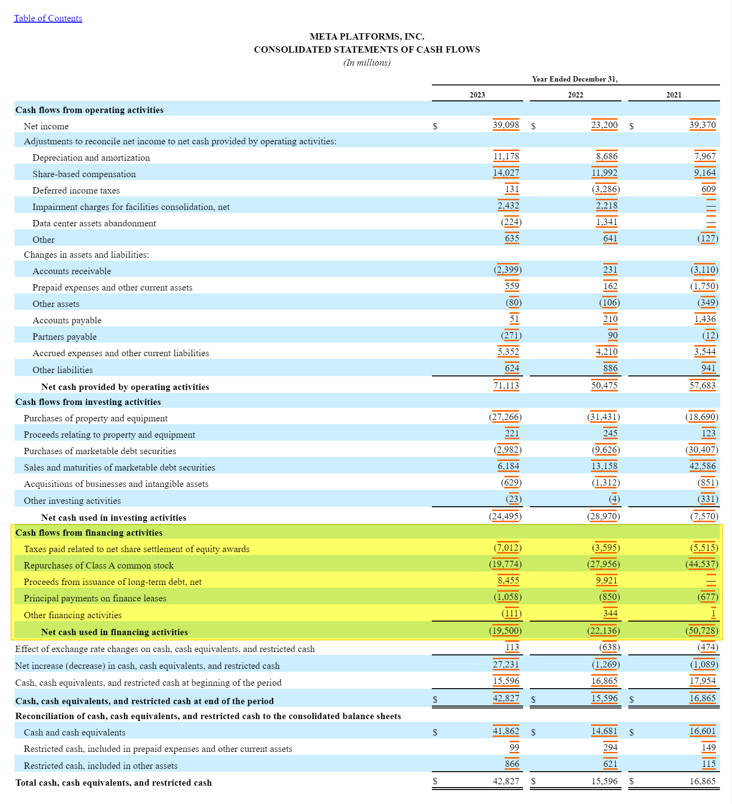
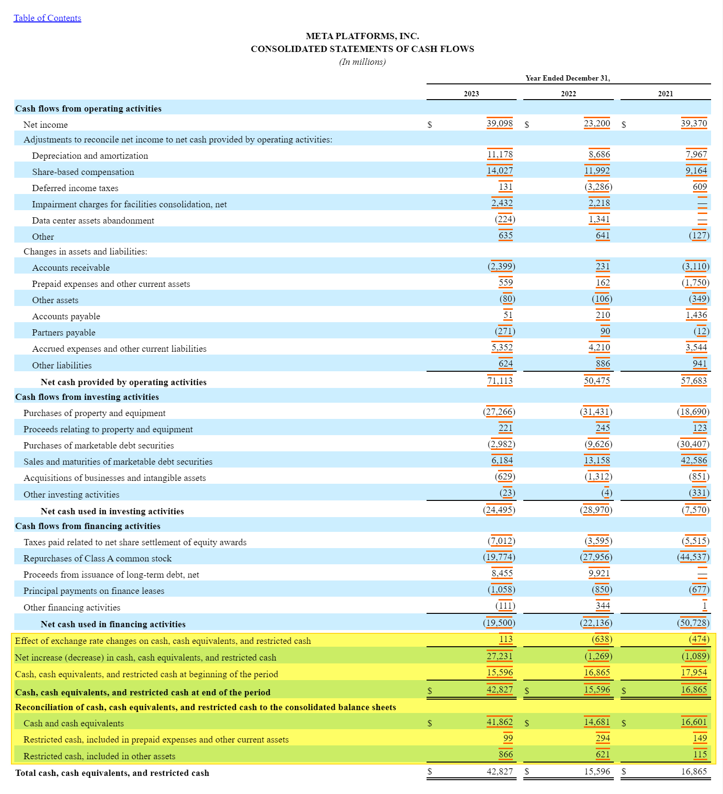

## Cash Flow Statement (현금흐름표)
기업의 현금흐름을 기억한 표 입니다. 
10K 에는 Consolidated Statement of Cash Flow 라는 항목으로 나타나며 Cash Flow Statement 라고도 부릅니다. 

- 참고 : [META - Consolidated Statements of Cash Flow](https://www.sec.gov/ix?doc=/Archives/edgar/data/1326801/000132680124000012/meta-20231231.htm)

 

 

현금흐름표는 크게 아래의 3 종류로 나눠집니다. 이번 문서에서는 아래 내용들을 중점적으로 정리합니다.
- 영업현금흐름 (Cash flows from operating activities)
- 투자현금흐름 (Cash flows from investing activities)

- 재무현금흐름 (Cash flows from financing activities)

 

그리고 밑에 부가적으로 나타난 두항목들 각각은 아래와 같은 의미를 가집니다.

- Cash, cash equivalents, and restricted cash at end of the period
  - 현금, 현금 등가물, 구속예금, 기말 잔액
- Reconciliation of cash, cash equivalents, and restricted cash to the consolidated balance sheets
  - 직역하면 `대차대조표 내의 현금, 현금등가물, 구속 예금 조정`이긴 한데, 이건 저도 검색이 안되어서 의미를 파악하는 것을 포기했습니다.

 

## 영업현금흐름 (Cash flows from operating activities)

### Net Income : 순이익

순이익으로 인한 현금유입은 39098 (Million) 입니다. 원달러 1350원을 기준으로 52조 7천8백원에 해당하는 금액입니다. 

### Adjustments to reconcile net income to net cash provided by operating activities: 순이익 조정항목 (영업활동으로 발생한 순현금에 대한 순이익 조정 항목)

> Adjustments to reconcile \~ 이 문구가 제가 볼때도 이상합니다. GPT3.5 가 Adjustments, reconcile 은 아래와 같은 의미로 쓰인답니다. "순이익 조정항목 (영업활동으로 발생한 순현금에 대한 순이익 조정항목)"은 제가 해석한 의역입니다.
>
> - Adjustments 
>   - 회계에서 조정이 필요한 항목들을 의미
>   - 순이익을 <u>실제 현금흐름</u>과 일치시키기 위해 수정해야 하는 회계항목들
> - Reconcile 
>   - 조정하다, 일치시키다 라는 의미를 가집니다. 
>   - 순이익과 <u>영업 활동으로 인한 현금 흐름</u> 사이의 차이를 줄이거나 일치시키는 과정 을 가리킬때 사용합니다.
>
> 따라서 "adjustments to reconcile" 은 순이익과 **영업활동으로 인한 현금 흐름**을 일치시키기 위해 필요한 조정사항을 의미합니다. 

 

- Depreciation and amortization : 감가상각비
  - 설비, 시설 등 자산의 노후 등에 대해 가치 하락분을 비용으로 잡아서 회계처리를 할때 이것은 실제 현금으로 지출된 비용이 아니기에 현금 흐름에는 이 값을 다시 더해줍니다.
  - `11178 (Million)` : 위의 표에서 11178 (Million) 는 현재 원달러 환율을 1350원으로 가정하면 15조원의 금액에 해당합니다. 시설이 노후되어 감가상각이 발생했는데 현금흐름표에서 감가상각비가 + 로 나타나고 있는데요. 이렇게 +로 나타난다는 것은 실제 자산/설비의 노후화 등으로 인해 감가상각이 이뤄졌으며, **감가상각에 대한 현금유출은 되지 않았기에 현금흐름표에서는 +로** 나타납니다.
- Share-based compensation : 주식으로 지급된 입금(보상)
  - 실리콘밸리 CEO 들 처럼 월급 대신 주식으로 월급을 받는 경우가 있습니다. 해외 빅테크 기업 직원들은 월급 중 일부를 주식으로 받는다고 합니다. 이렇게 월급의 일부를 주식으로 받는 것을 Share-based compensation 라고 부릅니다.
  - compensation 이라는 용어가 보통 임금 으로 취급되는 것으로 보입니다.
  - `14027 (Million)` : 14027 (Million) 가 소모되었는데요. 14027 (Million) 은 원달러 환율 1350 원일때 약 18조9천억원에 해당하는 금액입니다. 보상으로도 꽤 많이 나가고 있네요. 주식이라는 자산이 임금으로 지급되었어도 현금흐름표에서는 실제로 현금이 유출된 것이 아니기에 현금이 굳었다! 하는 방식으로 도출하면 현금흐름표에도 +로 표시되어 있다는 것을 확인 가능합니다.
- Deferred income taxes : 지연 소득세 (이연법인세)
  - 기업이 미리 지급한 세금을 조정해주는 항목입니다.
  - 세금 공제(Tax Benefit)를 받은 항목이 아니므로 영업현금흐름 계산 시에는 공제합니다.
  - `131 (Million)` : 원달러 1350원으로 환산하면 1768억원에 해당합니다. 실제 현금 유출이 일어나지는 않았으므로 + 로 표기되어 있습니다.
- Impairment charges for facilities consolidation, net : 시설통합으로 인한 자산가치 감소 비용
  - 기업이 운영 시설을 통합하거나 재구성할 때 발생하는 자산 손상 비용을 의미합니다. 이 항목은 시설 통합과 관련된 자산(예: 건물, 장비 등)의 가치가 장부 가치보다 낮아진 경우, 그 차액을 손상 차감으로 처리하는 것을 의미합니다.
  - 한국 회계 기준에서는 아래의 항목으로 표현합니다.
    - 시설 통합 손실
    - 시설 감소 손실
    - 자산 재평가 손실
  - Impairment charges for facilities consolidation, net 이 발생하는 원인은 시장가치하락, 사용불능, 기술진보로 인한 예전의 시설이 경쟁력이 없는 경우로 인한 폐기 또는 개조입니다.
  - `224 (Million)` : 224 (Million) 은 원달러 환율 1350원일때 3.28조원에 해당하는 금액입니다. 시설을 통합하거나 재구성으로 인해 장부가치보다 실물가치가 낮아졌는데 현금유출은 이뤄지지 않았으므로 +로 표기됩니다.
- Data center assets abandonment : 데이터 센터 자산의 폐기 또는 포기
  - Chat GPT에 물어보니 "데이터 센터 시설, 서버, 네트워크 장비, 저장 장치 등과 같은 데이터 센터 운영에 필요한 자산을 더 이상 사용할 수 없게 되거나 유지하는 것이 비효율적(노후화, 비용증가, 운영비용 절감 정책 등)일 경우, 해당 자산을 폐기하거나 철수하는 것을 의미" 한다고 합니다.
  - 현금 흐름표에서 "data center assets abandonment"은 일반적으로 마이너스(-)로 표시될 수 있습니다. 자산을 포기하거나 폐기할 경우, 그 자산의 장부 가치가 손실로 처리되거나 현금 유출을 야기할 수 있기 때문입니다. Meta 의 경우 영업활동항목에 - 로 표기 했지만, 투자활동 부분에 - 로 표시하는 기업도 있다고 합니다.
  - 현금 흐름표에서는 이 항목이 투자 활동 또는 운영 활동의 일환으로 마이너스(-)로 표시될 수 있습니다. 이는 시설 통합에 따른 비용이나 손상 비용이 현금 유출을 초래하기 때문입니다.
  - `(224 (Million))` : 224 (Million) 은 원달러 환율 1350원일때 3024억원에 해당하는 금액입니다. 노후된 데이터센터 폐기로 인한 자산 손실이 3024 억원이네요. 데이터 센터 폐기와 같은 행동은 실제로 현금이 유출되었다고 볼수 있기에 -로 표기합니다. 
- Other : 기타 항목
  - `635 (Million)` : 635 (Million) 은 원달러 환율 1350원일때 8572억원에 해당하는 금액입니다. 

 

### Changes in assets and liabilities: 영업 자산 및 부채 변화

- Accounts receivable : 순매출채권 (미수금)
- Prepaid expenses and other current assets : 선급비용 및 기타유동자산
  - Prepaid expenses (선급 비용(선급금))
    - 한국 회계기준에서는 "선급 비용", "선급금" 이라는 항목
    - 상품이나 서비스를 미리 지불한 비용. 회계 기간에 해당 상품이나 서비스를 소비할 때 비용으로 인식됩니다.
  - Other current assets (기타 유동자산)
    - 기타 유동자산은 미수금, 선급금, 재고자산, 단기 금융자산 등 1년 이내에 현금화될 수 있는 다양한 단기 자산들이 포함됩니다.
- Other assets : 기타 자산
- Accounts payable : 매입 채무
  - Accounts 는 일반적으로 "거래"를 의미합니다. Payable 은 "채무"를 의미합니다.
  - 풀어서 설명하면 "채무가 발생한 거래"를 의미하고, 한국 회계 용어로는 "매입채무"를 의미합니다.
- Partners payable : 파트너 미지급금
  - 기업이 파트너나 제휴 관계에 있는 다른 기업, 개인 등에게 아직 지급하지 않은 금액을 의미합니다.
- Accrued expenses and other current liabilities : 미지급 비용 및 기타 유동 부채
  - "Accrued"는 "누적된" 또는 "발생한" 이라는 의미입니다. Expenses 는 "비용"이라는 뜻 입니다.
  - Accrued expenses 회계 용어로는 "미지급 비용" 이며, 이미 비용 자체가 발생했지만 지불하지 않은 비용을 의미합니다. 한국어로 번역시 "발생한 비용"이라는 의미이지만, 회계 용어상 "미지급 비용" 이라는 의미로 쓰입니다.
  - Other Current Liabilities 는 기타 유동 부채를 의미합니다.
  - 기업의 단기 부채 중에서 "매입 채무"나 "미지급 비용"과 같은 특정한 부채 항목에 포함되지 않는, 다른 모든 단기 부채를 나타내는 용어입니다.
  - e.g. 단기 차입금, 단기 채무, 미지급 세금, 고객 예수금, 예수금, 단기적인 소송 관련 부채
  - 일반적으로 1년 이내에 지불 또는 상환될 예정인 부채들입니다.
- Other liabilities
  - **Net cash provided by operating activities**

 

## 투자 현금 흐름 (Cash flows from investing activities)

 

- Purchases of property and equipment : 유형자산의 매입 
  - 기업이 부동산, 기계, 차량, 설비, 건물 등의 유형 자산을 구매하거나 취득하는 데 지출한 금액을 의미합니다.
  - Purchases of property and equipment 는 현금흐름표에서는 투자활동 (Cash Flows from investing Activities)에 포함되며, 유형자산을 구매하는 데 사용된 현금 흐름을 의미합니다.
- Proceeds relating to property and equipment : 유형 자산 매각 대금 
  - Proceeds 는 `수입` 또는 `대금` 으로 번역됩니다.
  - 기업이 부동산, 기계, 설비, 차량, 건물 등의 유형 자산을 매각했을 때 얻은 대금을 의미합니다.
  - 재무제표의 현금 흐름표에서 투자 활동(Cash Flows from Investing Activities) 부분에 포함되며, 유형 자산 매각으로 인해 발생한 현금 흐름을 의미합니다.
- Purchases of marketable debt securities : 유동 부채 증권의 매입
  - 기업이 단기적으로 매매가 가능한 부채 증권, 예를 들어 회사채, 국채, 지방채, 기업어음(CP) 등과 같은 시장성 부채 증권을 구매하는 데 지출한 금액을 의미합니다.
  - Marketable Securities 는 "시장성 증권"을 의미하며, 쉽게 매매할수 있고 유동성이 높은 금융자산을 의미합니다. 일반적으로 주식, 회사채, 국채, 지방채, 상업용 어음(CP), 단기/장기 투자 상품을 의미합니다.
  - Marketable debt Securities 는 "시장성 부채 증권"을 의미합니다. 쉽게 매매가 가능한 유동성이 높은 부채 증권을 의미합니다. 일반적으로 회사채, 국채, 지방채, 단기기업어음(CP), 양도성 예금 증서(CD) 등 다양한 종류의 부채 증권이 여기에 해당합니다.
- Sales and maturities of marketable debt securities : 시장성 부채 증권의 매각 및 만기 상환
  - 기업 또는 개인이 보유한 시장성 부채 증권(회사채, 국채, 기업어음)을 매각했거나 보유한 증권이 만기일에 도달해 원금이 상환된 것을 의미합니다.
  - maturities 는 "만기" 또는 "만기상환" 이라는 의미로 쓰입니다.
- Acquisitions of businesses and intangible assets : 사업 및 무형 자산의 취득
  - 기업이 다른 기업이나 사업체를 인수하거나, 상표, 특허, 저작권, 영업권, 라이선스와 같은 무형 자산을 구매하는 행위를 의미합니다.
  - "intangible assets"는 "무형 자산"을 의미합니다.

 

## 재무 현금 흐름 (Cash flows from financing activities)

정리 예정!!! 으흑..

 

- Taxes paid related to net share settlement of equity awards : 자산 배분에 관련된 지급된 세금
  - 세금을 의미합니다. 주식을 보상(임금 중 일부 등)으로 제공할 때 발생하는 세금을 의미합니다. 주식 보상시에 세금 지불은 회사가 하며, 보상금은 주식의 순 지급으로부터 차감되어 지급됩니다.
  - "Settlement"은 여러 의미를 갖는 단어입니다. 일반적으로는 거래나 합의의 결과로 어떤 문제나 분쟁이 해결되는 과정이나 상황을 의미합니다. 위에서 쓰인 "Settlement" 의 뜻은 주식 보상 계획에서 발생하는 세금을 지급하고 직원하게 주식을 배분해서 발생하는 문제나 분쟁이 해결되는 과정을 의미합니다.

- Repurchases of Class A common stock : A급 보통주 재매입
  - 기업이 시장에서 자사의 보통주를 다시 매입하는 행위를 의미합니다.
  - 기업이 자기 자본의 일부를 환원하거나 주주가치를 증대시키는 경우에 주식을 매입합니다.
  - 주로 기업의 자금 구조 조정이나 주주 가치 최적화를 위해 이뤄지는 경우가 많습니다.

- Proceeds from issuance of long-term debt, net : 장기부채 발행으로 인한 수익, 순액
  - 기업이 장기부채를 발행하여 얻은 자금의 순액을 의미합니다.
  - "Proceed" 는 발생한 수익을 의미하고 "Issuance" 는 발행을 의미합니다.
  - Long-term debt 는 장기 부채를 의미합니다. net 은 수익에서 비용이 차감된 후의 순액을 의미합니다.
  - 즉, 기업이 장기채를 발행해서 얻은 자금의 순액을 의미합니다,

- Principal payments on finance leases : 금융 임대금의 원금 상환
  - 기업이 금융 임대를 통해 확보한 자산에 대한 원금 상환한 것을 의미합니다.
  - 금융 임대는 장비나 기타 자산을 사용하기 위해 임차인이 임대사로부터 돈을 빌리는 형태로 이루어지며, 이를 통해 임차인은 시간이 지남에 따라 임대자에게 원금을 상환합니다.
  -  원금 상환은 재무제표에서 기업의 현금 흐름을 파악하는 데 중요한 요소입니다.

 

## 기타

- Effect of exchange rate changes on cash, cash equivalents, and restricted cash
- Net increase (decrease) in cash, cash equivalents, and restricted cash
- Cash, cash equivalents, and restricted cash at beginning of the period
- **Cash, cash equivalents, and restricted cash at end of the period**
- **Reconciliation of cash, cash equivalents, and restricted cash to the consolidated balance sheets**
  - Cash and cash equivalents
  - Restricted cash, included in prepaid expenses and other current assets
  - Restricted cash, included in other assets

