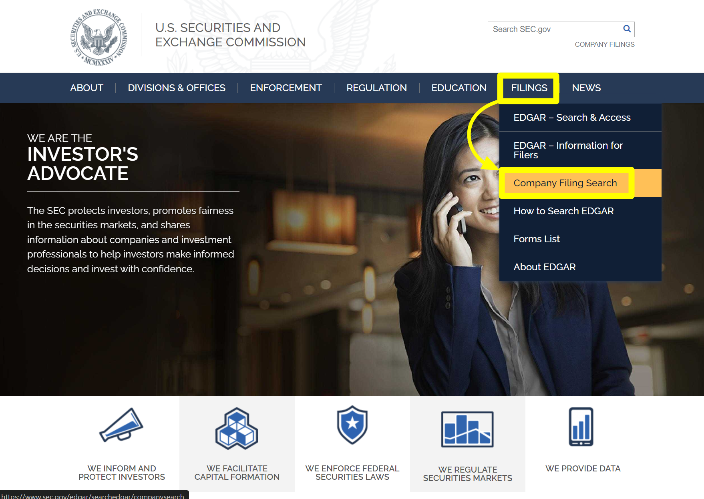
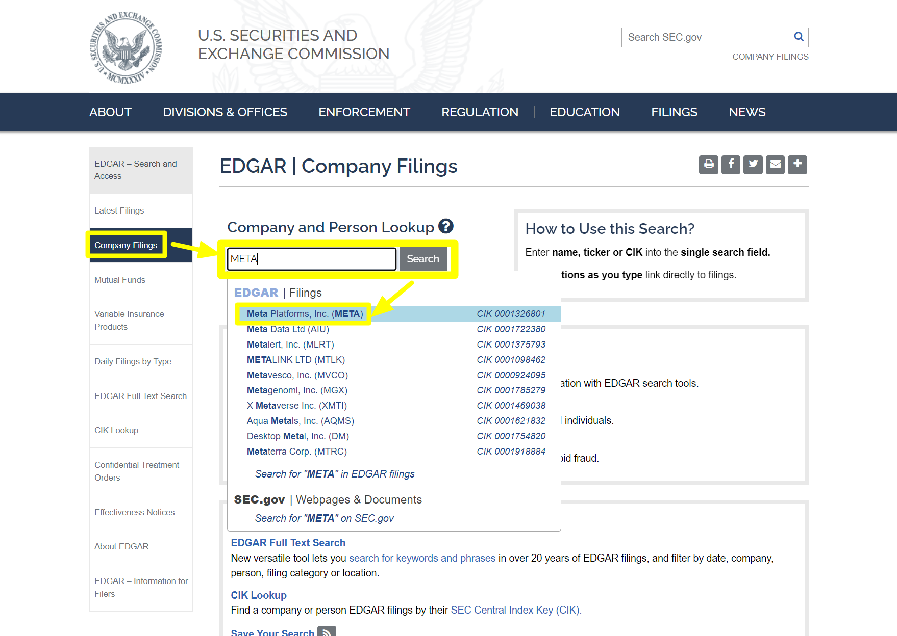
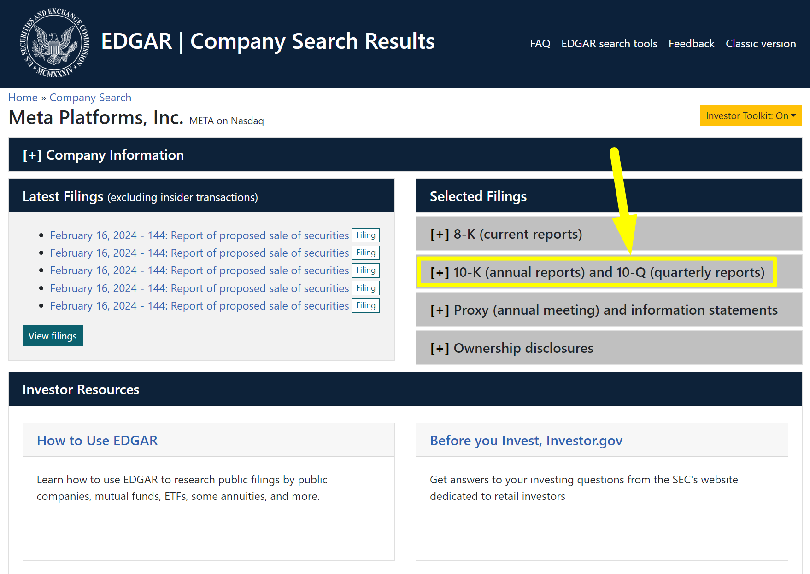
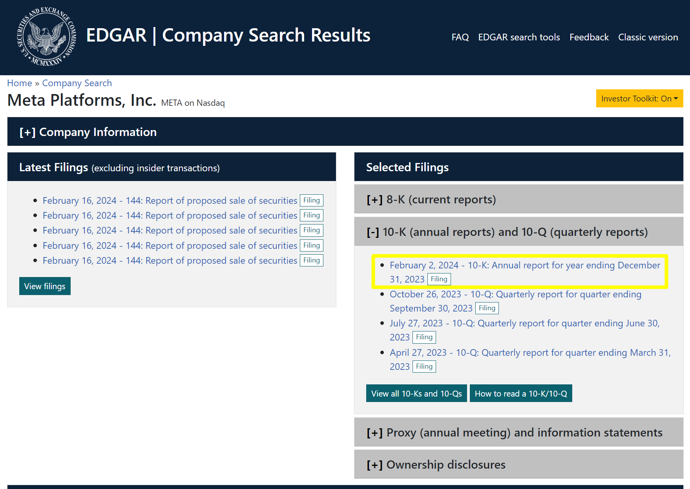
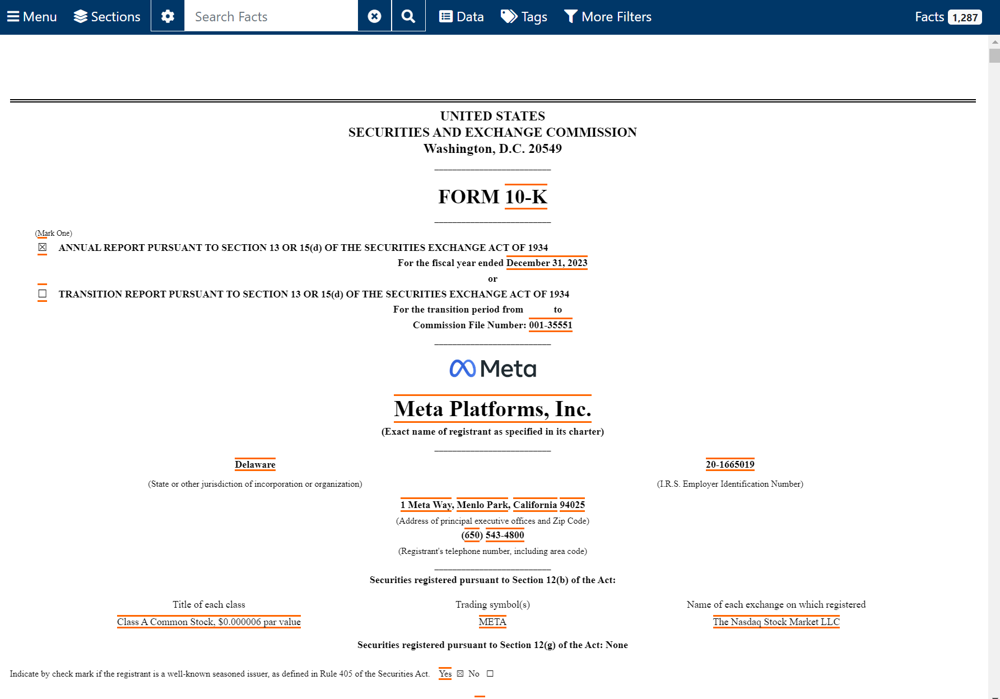

## 10-K 보고서의 주요 내용들 (SEC Form 10-K)

## SEC 에서 `META` 의 10-K 보고서 찾아보기
[sec.gov](https://www.sec.gov/) 에 접속합니다. `Filings` → `Company Filing Search` 를 클릭합니다.

 

`Company and Person Lookup` 메뉴에서 `META` 를 검색하고, `Meta Platforms. Inc. (META)` 라고 나타난 추천 검색 버튼을 클릭해서 `META` 의 공시페이지로 진입합니다.

 

`[+] 10-K (annual reports) and 10-Q (quarterly reports)` 섹션을 클릭합니다.

 

10-K 보고서를 클릭합니다.

 

META 의 연간보고서 페이지입니다.

 

아래로 스크롤 하면 아래와 같이 목차 페이지가 나타납니다.

 

