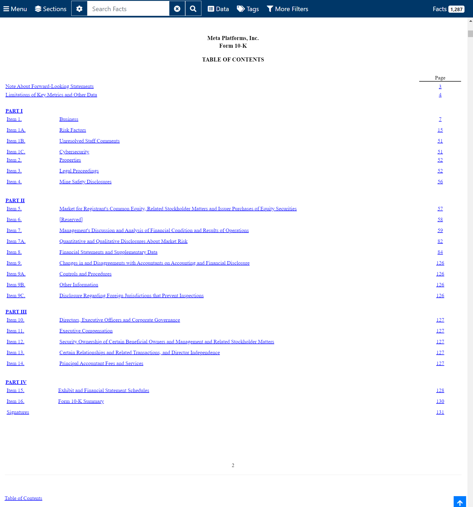
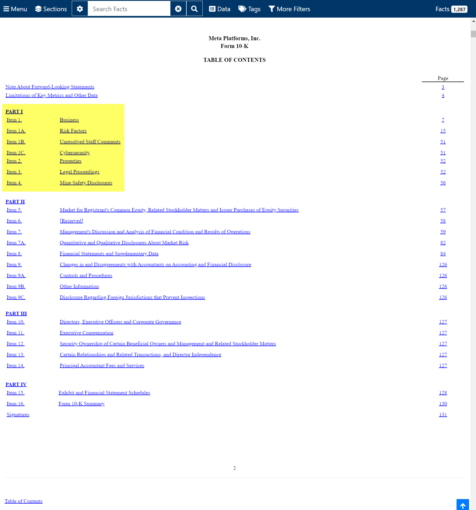
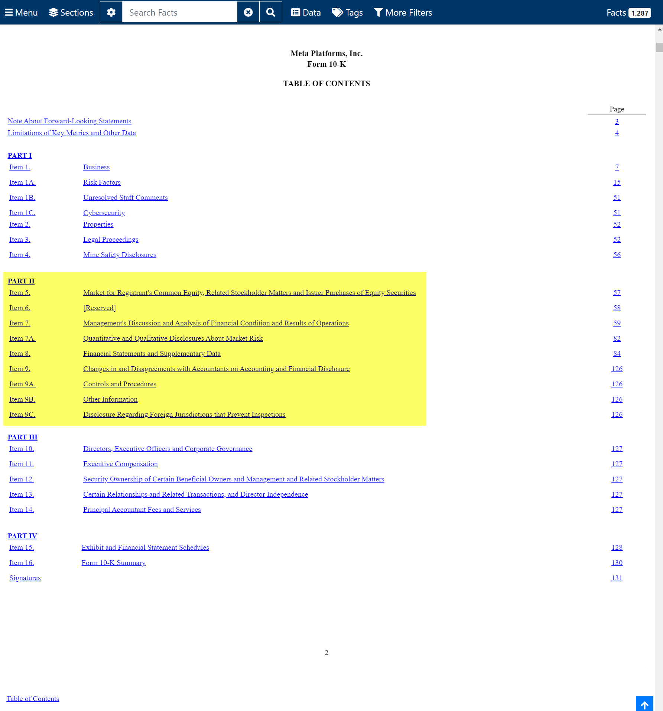
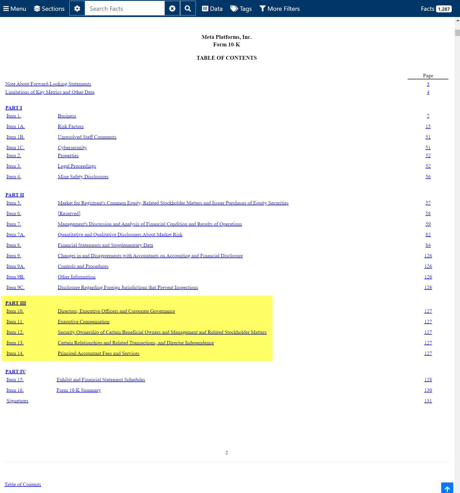
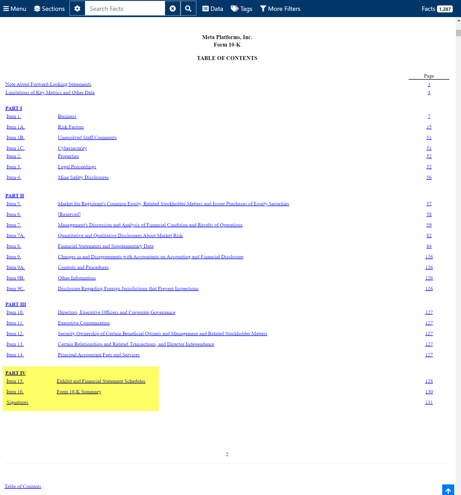

## 10-K 보고서의 주요 내용들 (SEC Form 10-K)

## 참고
이번 문서에서 살펴보는 공시는 Meta 의 2024.02 의 10-K 보고서 입니다. 아래 링크로 접속하면 바로 확인 가능합니다. 
- [META 의 Feburary 2, 2024 의 10-K(https://www.sec.gov/ixviewer/ix.html?doc=/Archives/edgar/data/1326801/000132680124000012/meta-20231231.htm)]
 

## SEC 에서 `META` 의 10-K 보고서 찾아보기
[sec.gov](https://www.sec.gov/) 에 접속합니다. `Filings` → `Company Filing Search` 를 클릭합니다.

 

`Company and Person Lookup` 메뉴에서 `META` 를 검색하고, `Meta Platforms. Inc. (META)` 라고 나타난 추천 검색 버튼을 클릭해서 `META` 의 공시페이지로 진입합니다.

 

`[+] 10-K (annual reports) and 10-Q (quarterly reports)` 섹션을 클릭합니다.

 

10-K 보고서를 클릭합니다.

 

META 의 연간보고서 페이지입니다.

 

아래로 스크롤 하면 아래와 같이 목차 페이지가 나타납니다.

 

이제부터 살펴볼 내용은 [META 의 Feburary 2, 2024 의 10-K(https://www.sec.gov/ixviewer/ix.html?doc=/Archives/edgar/data/1326801/000132680124000012/meta-20231231.htm)] 내의 주요 항목들입니다.

## Part 1 항목들 살펴보기 
이번에는 10-K 공시 내에서 Part1 항목을 살펴보겠습니다.

 

### Item 1. Business
[Item 1.Business](https://www.sec.gov/ixviewer/ix.html?doc=/Archives/edgar/data/1326801/000132680124000012/meta-20231231.htm#ibbcdb9a98fd34a92b3add929872a8009_19) 

사업 설명 항목입니다. 기업의 사업(비즈니스)에 대해 설명합니다. 경쟁요소, 규제, 사업이 어떤 시장에서 이뤄지는 지 등을 설명하고 있습니다. 

META 의 2024.02 10K 보고서에는 여러가지 기업에 대한 설명이 자세히 적혀있고 `Family of Apps Products` 라는 항목에서 Facebook, Instagram, Messenger, Threads, WhatsApp 이 있다고 설명하고 있습니다. 

`Reality Labs Products` 항목에서는 VR, AR 에 대해 설명하고 있습니다. 

`Competition` 항목에서는 우리의 사업은 혁신과 빠른 변화, 파괴적인 기술들로 특징지을 수 있다는 이야기와 함게 그와 관련된 설명을 하고 있습니다. 

### Item 1A. Risk Factors
[Item 1A. Risk Factors](https://www.sec.gov/ixviewer/ix.html?doc=/Archives/edgar/data/1326801/000132680124000012/meta-20231231.htm#ibbcdb9a98fd34a92b3add929872a8009_22) 

위험 요인 항목입니다. 잠재적인 위험 요소에 대해 설명합니다. 

내용을 읽어보면 마케팅 담장자의 지출 손실 또는 감소, 불리한 언론 보도 및 기타 위험, 전 세계 여러 국가에서 사업을 운영하는 점, 집단 소송을 포함한 소송, 정부 규제 및 지행과 관련된 위험 등에 대해서 언급을 하고 있습니다. 

### Item 1B Unresolved Staff Comments
[Item 1B.Unresolved Staff Comments](https://www.sec.gov/ixviewer/ix.html?doc=/Archives/edgar/data/1326801/000132680124000012/meta-20231231.htm#ibbcdb9a98fd34a92b3add929872a8009_25) 

이전 공시자료에서 SEC 로부터 받은 의견에 대해 아직 답변을 하지 않은 항목에 대해 설명을 적는 곳 입니다. 2024.02 월에 보고된 META 의 10K 보고서에는 `None.` 이라고 자신감 있게 적혀있습니다. 

### Item 1C.Cybersecurity
[Item 1C.Cybersecurity](https://www.sec.gov/ixviewer/ix.html?doc=/Archives/edgar/data/1326801/000132680124000012/meta-20231231.htm#ibbcdb9a98fd34a92b3add929872a8009_1844) 

사이버 보안에 관련된 내용입니다. META 의 2024.02 10k 보고서에는 위험 관리 프레임워크를 사용하고 있다는 내용과 기타 여러가지 내용들을 명시하고 있습니다. 

### Item 2. Properties 
[Item 2.Properties](https://www.sec.gov/ixviewer/ix.html?doc=/Archives/edgar/data/1326801/000132680124000012/meta-20231231.htm#ibbcdb9a98fd34a92b3add929872a8009_28) 

부동산, 물적 자산(Physical Asset)을 명시하는 항목입니다. 무형자산(지식재산권, 무형자산)은 포함되지 않습니다. 
 

### Item 3. Legal Proceeding
[Item 3.Legal Proceedings](https://www.sec.gov/ixviewer/ix.html?doc=/Archives/edgar/data/1326801/000132680124000012/meta-20231231.htm#ibbcdb9a98fd34a92b3add929872a8009_31)
법적으로 진행중인 소송 등에 대해 설명합니다. 

### Item 4.Mine Safety Disclosures
[Item 4.Mine Safety Disclosures](https://www.sec.gov/ixviewer/ix.html?doc=/Archives/edgar/data/1326801/000132680124000012/meta-20231231.htm#ibbcdb9a98fd34a92b3add929872a8009_34) 

광산 안전 관련 공시에 관련된 항목입니다. 광산과 관련된 기업일 경우 광산 안전,규제 등에 정보를 제공해야 합니다. 
META 의 10K 공시에는 `Not applicable.` 이라고 짧게 답변이 적혀있습니다. 

## Part2 항목들 살펴보기 

 

## Part3 항목들 살펴보기 

 

## Part4 항목들 살펴보기

 

