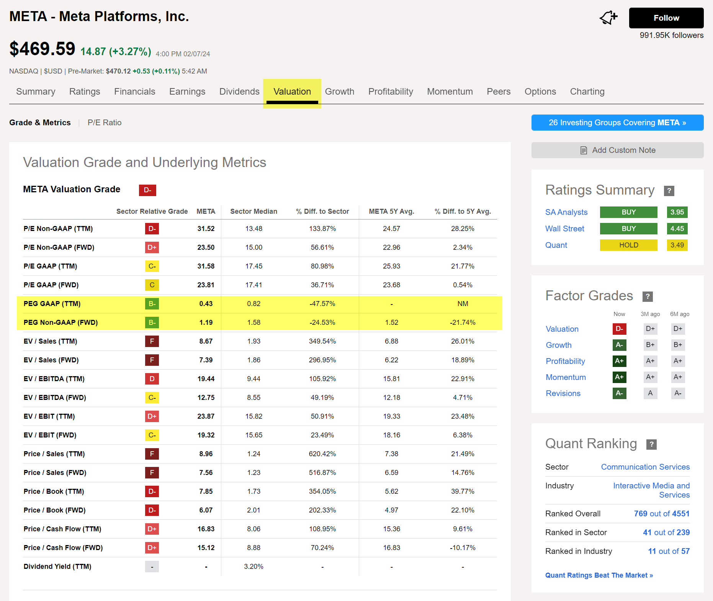
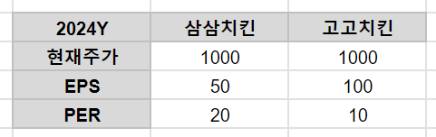
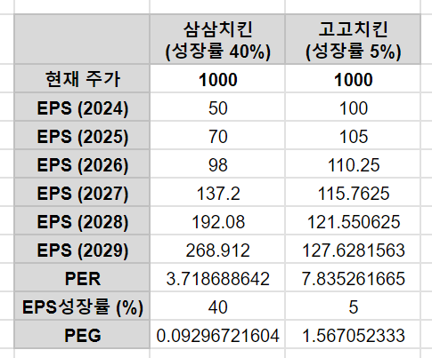

## Valuation 기초 용어들

## EPS (Earnings Per Share)
- 순이익 ÷ 발행주식수
- 순이익 / 발행주식수

순이익을 발행주식수로 나눈 것을 의미 
주식 하나당 순이익의 크기 
 

## PER (Price Earnings Ratio)
- 주가를 EPS 로 나눈 값
- 시가총액을 순이익으로 나누어도 PER 이 산출된다.
 

## BPS (Book Value Per Share)
- 주당 순 자산 
- 기업의 총 자산을 발행주식수로 나눈 개념
- 주당 자산가치가 얼마인지를 의미
 

## PBR (Price Book Value Ratio)
- 시가총액을 기업의 총 자산으로 나눈 것. 즉 기업의 총 자산에 몇배를 해야 시가총액에 가까운지를 의미
- 기업의 총자산을 시장에서 몇배로 생각하고 있는지를 의미
- 현재 주가를 BPS 로 나눈 결과 역시 PBR 과 같다.
 

## PSR (Price Sales Ratio)
- 시가 총액을 매출액으로 나눈 것을 의미
- PER 의 경우 시가총액을 순이익으로 나누지만 PSR 은 시가총액을 매출액으로 나눈다.
- 어떤 기업이 매출액은 높지만 재투자 등으로 인한 순이익이 낮을 경우 매출액을 몇배를 곱해야 시가총액에 도달하는지를 파악할 때 쓰는 개념
 

## PEG (Price Earning to Growth Ratio)
- 주당 순이익 성장비율
- PEG = (PER ÷ EPS 성장률) x 100
    - PER 을 성장률로 나눈 것을 백분위로 표시한 것
    - EPS 성장률이 높으면 높을 수록 PEG 는 낮게 나온다.
    - PER 을 그만틈 큰 수로 나누기 때문
- EPS 성장률 = 연평균 EPS 성장률 (3\~5 년)
 

피터린치는 PEG Ratio 에 대해 아래와 같이 이야기 했다고 한다.
- PEG Ratio 0.5 이하에서 매수하고 1.5 이상에서 매도하세요

PEG Ratio 가 0.5 이하라면 기업의 실적에 대한 성장률은 좋은데 주가는 저평가 되어 있다는 의미. 
PEG Ratio 가 1.5 이상이라면 실적성장률이 고평가되어 있다는 의미 
 

### Seeking Alpha 에서 PEG 찾아보기

 

### e.g. 치킨집을 예로 들어보면
`삼삼치킨`과 `고고치킨`이라는 회사가 있다. 이 두 회사의 EPS, PER, 주가는 아래와 같다.

 

이때 EPS 성장률이 일정하게 계속된다고 가정했을 때 2029년이 되었을 때의 PER 은 아래와 같이 책정된다.

 

삼삼치킨의 EPS 성장률이 더 높아서 5년 뒤에는 PER 이 더 낮아졌다. 
이때 PEG 는 삼삼 치킨이 0.1에 근사하고, 고고치킨은 1.6에 가깝다. 
5년치 실적까지 예상하는 것이 조금은 과하긴 하지만, 단적인 예를 통해 PEG와 성장주가 어떤 관련이 있는지를 보기에 단적으로 좋은 예인 것 같아서 예를 들었다. 
 

여기서 사용한 엑셀 파일은 아래링크에 파일로 저장해두었다. 
 

[치킨집 PEG](https://github.com/chagchagchag/docs-us-stock-basic/tree/main/pages/valuation-terms/xlsx)
 
