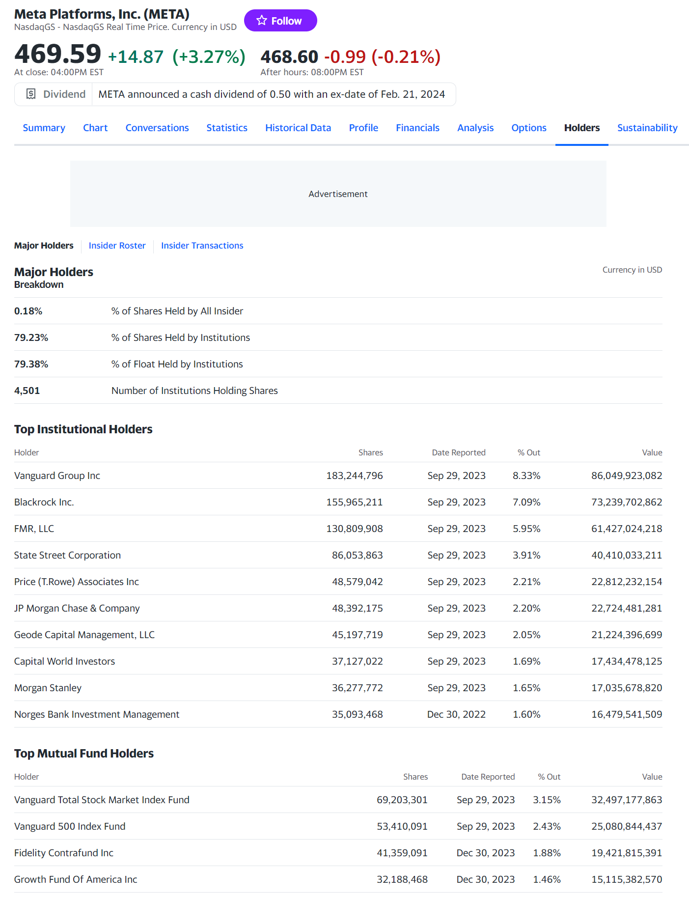

## Holders 섹션

 

Major Holders
- 주요 투자자 비중
 

% of Shares Held By All Insider 
- 내부자 (Insider) 비중
 

% of Shares Held By Institutions
- 기관투자자 (Institutions) 비중
- 미국 주식 역시 기관투자자 비중을 알 수 있는데, 어떤 종목의 기관투자자 비중이 높다는 것은 수익률이 높을 수도 있을 것이라는 추측 역시 가능해진다.
 

% of Float Held By Institutions
- 유동 주식 중 기관투자자 비중 
 

Number of Institutions Holding Shares
- 해당 주식 보유한 총 기관 수 
 

Top Institutional Holders
- 상위 기관투자자 
- 연금, 자산운용사 등 투자자 중 보유 비중이 높은 기관투자자 들의 이름, 보유 주식수, 정보공개 날짜, 보유 비중, 보유 가치 등
 

Shares
- 보유 주식수
 

Date Reported
- 보유 현황 공개 날짜
- 기관투자자는 보유 종목의 현황을 정기적으로 공시해야 함
 

% Out 
- 상위 기관 투자자 보유 비중
 

Value
- 보유주식의 가치 
 

Top Mutual Fund Holders
- 상위 뮤추얼 펀드 투자자
- 기관 투자자 중 뮤추얼 펀드 투자자가 누구인지를 알려주는 자료 
 

