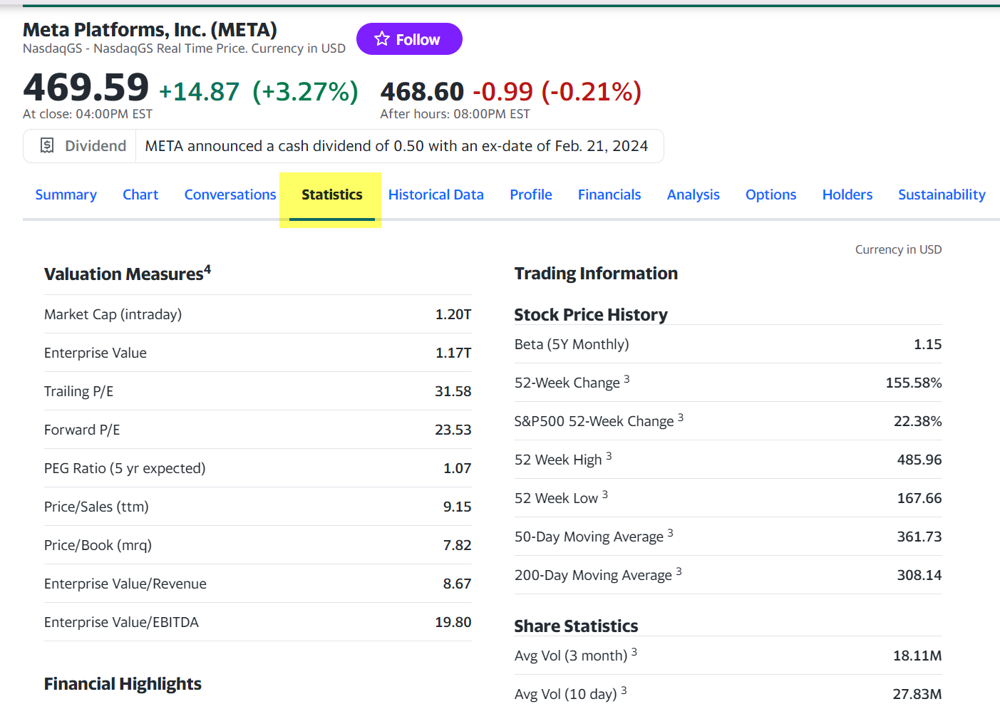
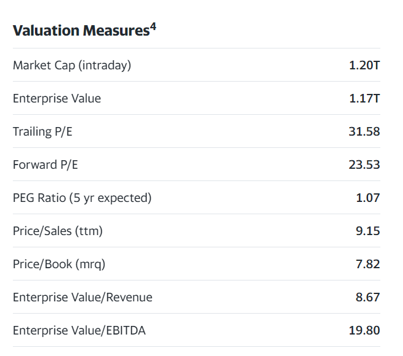
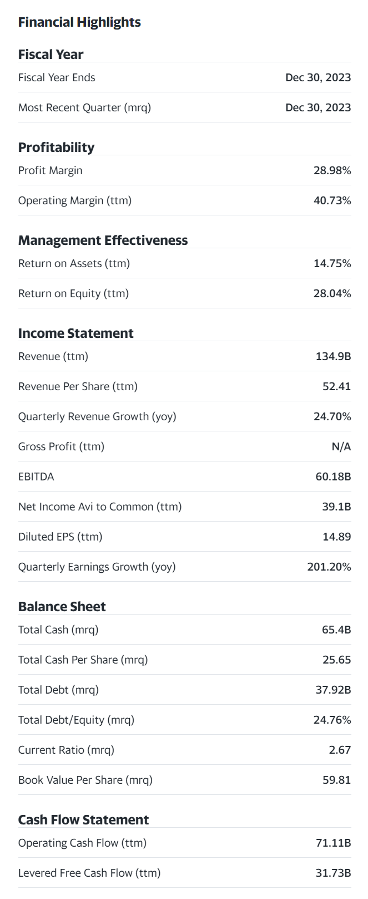
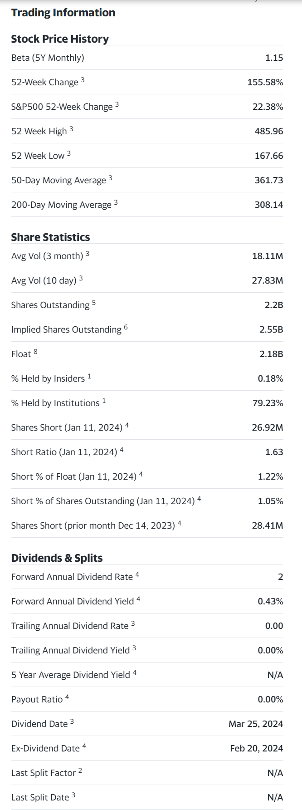

## Statistic 섹션

 

## Valuation Measures (밸류에이션 지표)
> 기업 밸류에이션을 산정한 지표들

Market Cap (Intrada)
- 실시간 시가 총액
- 발행주식수 x 현재 주가
 

Enterprise Value 
- 기업 가치
- EV 라는 줄임말로 자주 쓰임
- 시가총액과 더불어 기업가치를 볼 때 많이 사용되는 지표 
- 시가총액 + 기업의 총 부채(장/단기 부채 모두 포함), 단 기업의 현금 및 현금성 자산은 제외
- 기업 인수 시에 이론적인 인수가격으로 여겨지고, M&A 시에 우선적으로 계산하는 밸류에이션
예를 들어 어떤 기업을 인수하게 되면 그 기업이 현재 가지고 있는 부채도 함께 가져와야 하기에, 주식시장에서 매기는 기업의 가치인 시가총액에 기업의 총부채를 더한 가격이 총 인수가격으로 여겨집니다. 
 

Trailing P/E
- 과거 주가 수익비율
- 과거 1년간(최근 4개 분기) 주당 순이익을 기준으로 한 PER 을 의미
 

Forward P/E 
- 향후 4분기 간의 기업 이익 추정치를 기준으로 한 PER
- Foward EPS 계산 시 애널리스트들이 추정하는 기업 이익 추정치의 평균치를 사용
- 과거 PER 인 Trailing P/E 는 이미 주가에 반영되어 있다고 보기에 Forward P/E 를 실질적으로 가장 많이 쓰이는 지표
 

PEG Ratio (5yr expected)
- 주가 수익 성장 비율 
- PER을 기업이익 성장률로 나눈 값
- PER 에 성장성을 더한 개념
- PER 이 낮으면 기업의 성장성 대비 PER 이 낮은 것으로 평가 가능
- 기업 이익은 연도별로 등락이 크기에 성장률은 보통 1년으로 평가하기 보다 3년, 5년평균을 기준으로 계산함
 

Price/Sales (ttm) 주가 매출 비율
- 주당 매출액 대비 현재 주가 비율
- 매출액대비 현재 주가가 몇배인지를 보는 개념
- 기업의 순이익이 마이너스이거나 작거나, PER 이 큰 의미가 없을 때 사용
- 아마존 같은 커머스 기업이나 바이오기업, 테크 기업에 많이 이용되는 개념
 

Price/Book (mrq)
- mrq : `Most Recent Quarter`
- Book Value per Share (BPS) 를 계산에 사용
- 자산 가치를 주식 수로 나눈 것을 의미 
 

Enterprise Value/Revenue
- 매출액(Revenue) 대비 기업가치 비율
 

Enterprise Value/EBITDA
- EV/EBITDA
- 법인세 이자 감가상각비 차감 전 영업이익 대비 기업가치 비율
 

## Financial Highlights
> 주요 재무지표

 

Fiscal Year 
- 회계 연도
 

Fiscal Year Ends
- 회계 연도 말 날짜
- 기업마다 회계연도가 다르기에 확인해야 함
 

Most Recent Quarter (mrq)
- 최근 분기말
 

Profitability
- 수익성
 

Profit Margin
- 매출 대비 이익
- 이익을 매출로 나눈 것을 의미 (참고 : [Gross Profit Margin : 매출 총이익률](https://brunch.co.kr/@leedongins/138))
- Margin 이 붙으면 '매출 대비' 라고 생각하면 된다.
 

Operating Margin (ttm)
- 최근 4개 분기 매출 대비 영업이익 
- 최근 4개 분기 영업이익을 최근 4개분기 매출로 나눈 것을 의미 
- OP 마진 이라는 말로도 많이 쓰임
 

Management Effectiveness 경영 효율성
 

Return on Assets (ttm)
- ROA 
- 최근 4개 분기 자산 대비 순이익 
- 참고) A on B 는 'B 대비 A' 로 해석하면 되고, 'B분의 A', 'A 나누기 B' 라고 표현된다.
 

Return on Equity (ttm)
- ROE
- 최근 4개 분기 자본 대비 순이익
 

Income Statement 손익계산서
- 1개 회계기간에 기업의 모든 비용, 수익을 비교해 손익을 보고하는 계산서 
 

Revenue (ttm)
- 최근 4개 분기간(최근 1년간) 매출액
 

Revenue Per Share (ttm)
- 최근 4개 분기(최근 1년간) 주당 매출액
 

Quarterly Revenue Growth (yoy)
- 분기매출액 연성장률
 

Gross Profit (ttm) 최근 4분기간(최근 1년간) 매출 총이익
- 매출액에서 매출원가를 뺀 매출이익
 

EBITDA (Earnings before interest, Texes, Depreciation and Amortization)
- 법인세, 이자, 감가상각비 차감 전 영업이익
- 영업이익에 법인세, 이자, 감가상각비가 포함되어 있는 상태
 

Net Income Avi to Common (ttm)
- 최근 4개 분기(1년)간 보통주 순이익
- Avi 는 Available 의 줄임말
- Net Income Avi to Common Stock(NIAC) 은 소득세와 우선주에 할당된 배당금을 제한 후의 순수익을 의미함.
- 기본 EPS 주당 순이익을 구할 때는 NIAC 를 발행주식 수로 나눈다. 
 

Diluted EPS(ttm)
- 희석 주당 순이익 (ttm : 지난 12개월 기준)
- 유통되는 일반 주식 외에 보통주로 전환이 가능한 모든 주식(스톡옵션, 워런트,전환사채)을 기준으로 구한 EPS
- 일반적인 EPS보다 더 낮아지게 된다. 이렇게 일반주식외에 모든 주식을 포함해서 EPS를 구한 것을 희석 주당 순이익 (Diluted EPS) 라고 부른다.
 

Quarterly Earnings Growth (yoy)
- 분기 이익 연 성장률 (전년 동기 대비 성장률)
- 최근 분기 이익이 전년 분기 이익 대비 얼마나 변했는지를 보여주는 지표 
- 계절을 타는 산업의 경우 분기별 이익 보다 시기(시즌)마다 어떻게 다른지를 보는게 더 나을수도 있기에 사용하는 지표 
 

Balance Sheet
- 대차대조표
- 특정 시점에 기업이 보유하고 있는 자산, 부채, 자본에 대한 정보를 보고하는 양식
 

Total Cash (mrq)
- 총 현금
 

Total Cache per Share (mrq) 
- (가장 최근 분기) 주당 현금
- 총 현금을 발행 주식 수로 나눈 금액
 

Total Debt (mrq)
- (가장 최근 분기) 총 부채
 

Total Debt/Equity (mrq)
- (가장 최근 분기) 자본 대비 총 부채 비율
 

Current Ratio (mrq)
- (가장 최근 분기) 유동 비율
- 유동 부채 대비 유동자산 비율. 기업의 재무 건전성을 볼때 많이 쓰이는 지표
- 이 비율이 낮으면 1년 동안 갚아야 할 단기부채를 단기자산으로 메울 수 없어서 단기 재무 건전성이 안좋다고 판단 
- 1년 내 현금화 가능한 단기부채 대비 1년 내 현금화할 수 있는 단기 자산 비율
 

Book Value per Share (mrq) (가장 최근 분기) 주당 순자산 가치
- BPS
- 1주당 순 자산이 얼마나 되는지를 나타내는 지표
 

Cash Flow Statement 현금흐름표
- 일정 기간 기업의 현금 흐름을 나타내는 표 
- 기업의 현금이 어디서 창출되었는지 어떻게 사용되었는지를 파악가능
 

Operating Cash Flow
- 영업활동에 의해 창출된 현금 흐름
 

Levered Free Cash Flow
- 부채 반영 잉여현금 흐름
- FCFE(Free Cash Flow to Equity) 라고 부르기도 한다.
- 모든 부채를 갚은 이후 기업에 남아있는 현금 여력, 즉 채권자에 대한 의무를 다한 이후 주주에게 돌아가는 몫
 

Dividends & Splits
- 배당 & 주식분할
- 배당 : 기업이 주주에게 소유지분에 비례해서 이윤을 분배하는 것
 

Forward Annual Dividend Rate 
- 다음년도 1년간 주당 배당금 추정치
- 분기배당, 반기배당, 특별 배당 등 모든 배당금을 포함한 추정치 
 

Forward Annual Dividend Yield
- 다음년도 1년간 배당 수익률
- 주당 배당금을 주가로 나눈 값
- 현재 주가 대비 배당금으로 얻는 수익률이 얼마인지를 계산
 

Trailing Annual Dividend Rate
- 지난 1년간 주당 배당금
 

Trailing Annual Dividend Yield
- 배당 수익률은 한주 가격 대비 배당금의 비율
 

5 Year Average Dividend Yield
- 5년 평균 배당 수익률 
- 현재 배당 수익률과 비교해서 현재 배당 수익률이 매력적인지를 비교해보자.
 

Payout Ratio 
- 배당 성향
- Payout 은 배당금을 의미
- 배당 성향은 기업이 번 돈(이익) 대비 얼마를 주주들에게 배당금으로 주는지를 나타내는 비율
- 이 비율이 높으면 번 돈(이익) 대비 배당을 많이 하는 기업
 

Dividend Date
- 배당지급일
- 보통 Payment Date 라고도 부른다.
- 실제 내 계좌에 배당금이 들어오는 날
- 배당락일(Ex-Dividend Date)로부터 며칠 내지 몇달 후
 

Ex-Dividend Date 
- 배당락일
- 배당금 받을 권리가 없어지는 Ex-Dividend 날을 의미
- Ex-Dividend Date 의 1영업일 이전 가지 주식을 매수해야 해당 분기 배당금을 받을 수 있음
- 배당락일에 주식을 팔아도 배당금을 받을 수 있다. 보통 주가가 배당금을 반영해서 하락하는 편
 

Last Split Factor 
- 마지막 (가장 최근) 주식 분할 비율
- Split 은 '쪼개다, 분할하다' 라는 의미.
- Last Split Factor 비율이 4-for-1 이라면 현재 1주가 주식 분할 이후에는 4주가 된다.
 

Last Split Date
- 마지막 (가장 최근) 주식분할 날짜
 

## Trading Information

 

Stock Price History
- 트레이딩 정보
 

Stock Price History
- 과거 주가 관련
 

Beta (5Y Monthly)
- 베타 (5년치 월간으로 계산)
- 1보다 크면 시장보다 변동성이 높고, 1보다 작을수록 시장보다 변동성이 낮음을 의미 
- 참고) 2024.02.08 년도 현재 MSFT 의 베타는 0.90, TSLA의 베타는 2.43 이다.
 

52-Week Change
- 지난 52주, 즉 지난 1년간 주가 수익률
 

S&P 52-Week Change
- S&P 의 지난 52주간 수익률 
- 현재 보고 있는 주식의 52주간 수익률이 S&P 500 어떤지 비교할 때 사용하기 위해 제공되는 지표.
- 지수 수익률 대비 현재 보고 있는 주식 수익률이 차이가 큰지를 보고 트렌드에 맞는지를 판단 가능
 

52 Week High
- 52주 신고가
- 1년간 가장 높은 가격
 

52 Week Low 
- 52주 신저가 
- 1년간 가장 낮은 가격 
 

50-Day Moving Average
- 지난 50일간 주가 이동 평균 값
- 일주일에 보통 5일 거래되므로 10주간 이동 평균 값을 의미
- 현재 주가가 50일가의 평균 주가보다 낮은지 높은지 볼 수 있다.
 

200-Day Moving Average
- 지난 200일간(약 40주) 주가 이동평균 값 
 

Share Statistics 
- 주식 통계
 

Avg Vol (3 months) 
- 평균 거래량 (3개월)
- Three Months Average Volume 
- 일간 주식 거래량의 3개월 평균치 
 

Avg Vol (10 day)
- 평균 거래량 (10일)
 

Shares Outstanding 
- 발행 주식수
 

Implied Shares Outstanding
- 전환사채 등을 반영한 예상 주식 수
 

Float 
- 유동 주식수
- 발행 주식의 일부분은 시장에서 거래되지 않는데, 그것을 제외하고 거래되는 주식수를 의미함
 

% Held By Insiders
- 전체 주식 중 내부자가 소유한 비율
- 내부자는 기업의 고위급 임원 또는 10% 이상 의결권을 가진 사람을 의미
- 내부자의 거래 내역은 투자자에게 중요한 신호가 되기도 한다.
 

% Held By Institutions
- 기관 투자자 비중
 

Shares Short
- 공매도 주식수
 

Short Ratio
- 공매도 포지션을 정리하는 데 걸리는 시간 
- 공매도 투자자들이 해당 종목의 공매도 포지션을 정리하는 데 며칠이 걸리는지를 의미.
- 공매도 주식 수를 일평균 거래량으로 나눈 값
- 이 값이 크면 공매도 포지션을 정리하는 데 시간이 오래 걸리고 이렇게 시간이 오래 걸린다면 주가의 하락 가능성이 높음을 의미함
 

Short % of Float 
- 전체 유동 주식 수 대비 공매도 비율
 

Short % of Shares Outstanding
- 전체 발행 주식수 대비 공매도 비율 
 

