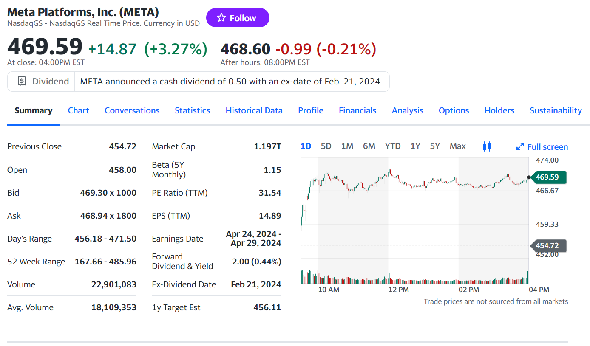
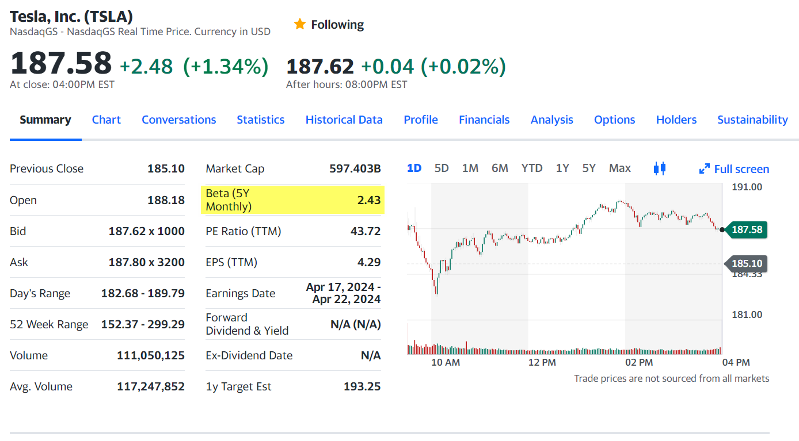
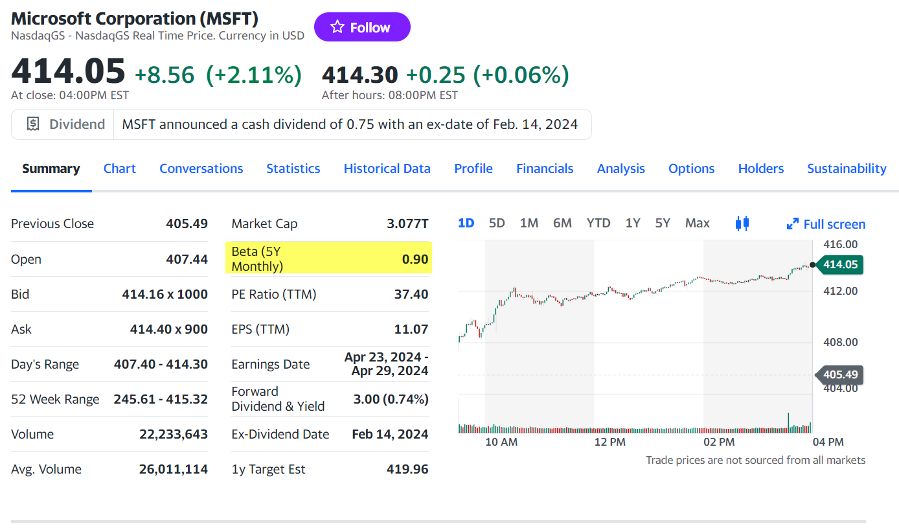
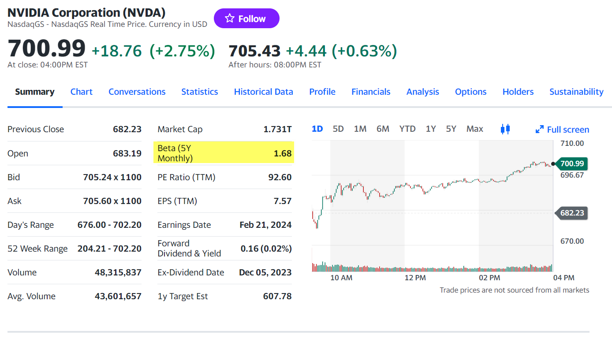

## Summary 섹션

Previous Close	454.72
- 전일 종가
Open	458.00
- 시작가격
Bid	469.30 x 1000
- Bid Price
- 매수자가 지불할 의향이 있는 가장 높은 가격
Ask	468.94 x 1800
- Ask Price
- 매도자가 매도할 의향이 있는 가장 낮은 가격
Day's Range	456.18 - 471.50
- 종목의 최저가 \~ 최고가 범위
52 Week Range	167.66 - 485.96
- 52주 최저가 \~ 52주 최고가 
- 1년은 대략 52주의 주(Week)로 분류
Volume	22,901,083
- 거래 주식 수
- 거래량이 너무 적은 종목은 투자에 유의해야 합니다. 거래량이 적으면 몇개의 호가만으로 주가 조작이 가능하기 때문입니다.
- 기관 투자자들은 거래량이 적은 종목은 아예 투자 대상에서 제외하는 경우가 많습니다.
- 주식을 매수할 때도, 매도할때도 시간이 오래걸리고, 체결이 안되는 경우도 있고 가격이 왜곡되기도 할 가능성이 높기 때문.
Avg. Volume	18,109,353
- 3개월 또는 1개월 간의 일간 거래량 평균
- Yahoo Finance 에는 몇개월 평균인지 명시되어 있지 않은 상태
- 일간 거래량은 일시적인 이유로 급당, 급감할 수 있는데, 보통 평균거래량을 통해 거래량이 급감하거나 급등했는지를 체크해서 거래량에 문제가 있는지를 체크.
Market Cap	1.197T
- 시가총액
- 종가 x 상장주식수
- 주식시장에서 매겨지고 있는 이 회사의 가격
- T : Trillion
- B : Billion
- M : Million 
- e.g. `1.5T` : 1.5조 달러
Beta (5Y Monthly)	1.15
- 베타를 통해 주가의 변동성을 추론 가능합니다.
- 주가의 움직임이 시장 대비 클수록 베타가 커집니다.
- 1보다 클수록 변동성이 높고 1보다 작을 수록 변동성이 낮음을 의합니다.
PE Ratio (TTM)	31.54
- 기업 이익 대비 주가 비율 
- 주가를 EPS 로 나눈 가격. 또는 시가총액을 영업이익으로 나누기도 함.
- `TTM` 은 `Trailing Twelve Months` 의 약자입니다.
- PE Ratio (TTM)은 지난 12개월간 기업의 이익을 기준으로 산출한 PER 이라는 의미입니다.
EPS (TTM)	14.89
- Earnings Per Share
- 12개월간 벌어들인 이익이 한 주당 얼마인지를 의미. (영업이익을 발행주식수로 나눈 값)
- `TTM` 은 `Trailing Twelve Months` 의 약자입니다.
Earnings Date	Apr 24, 2024 - Apr 29, 2024
- 실적 발표 날자
Forward Dividend & Yield	2.00 (0.44%)
- 향후(Forward) 주당 배당금 & 배당 수익률
- 분기실적을 발표할 때 다음 분기 배당금,배당락을 발표합니다.
Ex-Dividend Date	Feb 21, 2024
- 배당락일 (배당을 받을 권리가 없어지는 날)
- Meta 의 다음 분기 배당락일은 2024년 2월 21일이고 여기에 대한 배당을 받고 싶으면 2월 20일까지는 주식을 매수해둔 상태여야 합니다.
- 배당락일에 대한 자세한 설명은 아래에 정리해두었습니다.
1y Target Est	456.11
- 1년 목표주가 
- 종목을 분석하는 증권사 애널리스트들의 목표주가 평균치를 의미합니다.
 

## Bid, Ask, Bid-Ask 스프레드
주식 시장은 주식을 사고 파는 하나의 거래를 하는 곳 입니다. 
매도자는 팔려는 가격을 정해서 매도 가격을 제출하는데 이것을 매도호가(Ask)라고 부릅니다. 
매수자는 사려는 가격을 정해서 매수 가격을 제출하는데 이것을 매수호가(Bid)라고 부릅니다. 
- [참고) 영어사전 : Bid](https://en.dict.naver.com/#/search?query=bid)
 

Bid Price 는 매수자가 지불하려고 하는 가격 중 가장 높은 가격이고 Ask Price 는 매도자가 매도하려는 가격 중 가장 낮은 가격입니다. 
매수가격과 매도가격 간의 차이를 Bid-Ask 스프레드라고 부릅니다. 
보통 이런 스프레드를 통해 거래량이 적은 종목일 수록 시장 조성자들이 차익을 실현하는 경향이 높고, 거래량이 많고 비교적 안정적인 종목일 수록 시장 조성자의 위험이 작아지기에 스프레드가 작습니다. 
 

## 베타 (Beta)
베타를 통해 주가의 변동성을 추론 가능합니다. 
주가의 움직임이 시장 대비 클수록 베타가 커집니다. 
1보다 클수록 변동성이 높고 1보다 작을 수록 변동성이 낮음을 의합니다. 
2024.02.08 기준 테슬라의 Beta 는 2.43 입니다. 

 

반면 MSFT 의 Beta 는 0.90 입니다. 

 

NVDA 의 Beta 를 살펴보면 1.68 입니다. 

 

## 배당락일 (Ex-Dividend Date)
배당락일은 배당을 받을 권리가 없어지는 날을 의미합니다. 
주식을 사고 나서 주주명부에 내 이름이 올라가기 까지는 2영업일이 걸립니다. 2영업일은 행정처리 등에 걸리는 시간입니다. 따라서 배당 기준일 이틀 전까지는 주식을 갖고 있어야 합니다. 
배당락일에 주식을 팔아도 그 다음날인 배당 기준일에 주주로 기록되어 있기에 배당금은 여전히 나옵니다. 
Meta 의 다음 분기 배당락일은 2024년 2월 21일이고 여기에 대한 배당을 받고 싶으면 2월 20일까지는 주식을 매수해둔 상태여야 합니다.
 

